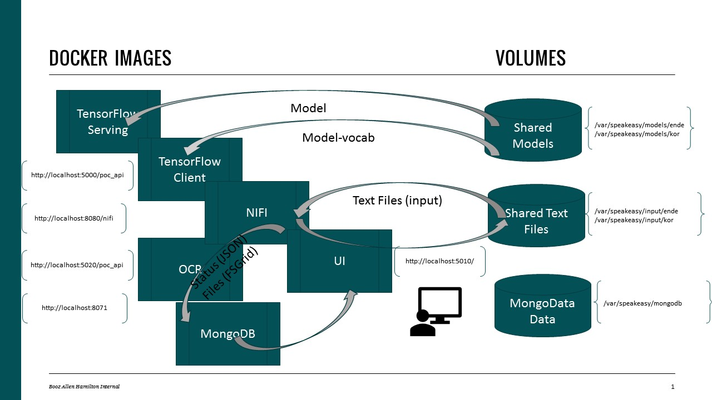

# **Speakeasy**

## *What is Speakeasy*
> Investment/POC to Translate text files containing Korean Language to English.

> Walk Walk (V0.3)
>> Dataflow to pull in a text file and translate using existing translation model.  
>> Focus on the data flow
>> This is based on the "toy-ende" model which uses german translation.
>> "Hooks for Korean"
>> Version V0.1 used Postgres - V0.2 swappted to MONGODB - V0.3 still suffering with MongoDB.
>> Added pytess ocr_client to the mix... kinda works for jpg/png files only.



## PREREQs on VM (these steps are REQUIRED):
Install tools per your operating system instructions.  (Installation steps are outside the scope of Speakeasy.)

> docker, EG:
```
$ docker --version
Docker version 17.09.1-ce, build 19e2cf6
```
> docker-compose supporting version "3", EG:
```
$ docker-compose version
docker-py version: 3.5.0
CPython version: 3.6.6
OpenSSL version: OpenSSL 1.1.0f  25 May 2017
```
> git 
```
git --version
git version 2.9.5
```
> BAH link (need VPN)
```
https://github.boozallencsn.com/tampaml
```

## Dev Steps

1. Setup
```
# Assumption is that you setup your token to clone from BAH...
# GOTTA BE ON THE VPN:
cd
git clone https://github.boozallencsn.com/tampaml/speakeasy.git --branch V0.3
```

2. Run setup script
```
# Log off the VPN now!
cd speakeasy
#  quickstart setups up the filesystem and fetches the ende model.
./quickstart.sh
```

4. UI
* http://localhost:5010
* Upload a sample file - /home/$USER/speakeasy/txt

5. Mongo
* http://localhost:8071/
* Sanity check after first upload:
  * A database named 'speakeasy' will be created after first upload
  * In the database speakeasy, a collection named 'nifi' will be careted after first upload

6. NIFI
* http://localhost:8080/nifi/
* Sanity check after first upload:
  * Check that it is in a run state (no red boxes)

7. TF Client
* Swagger shows different entry points
* http://localhost:5000/poc_api/

8. OCR Client
* Swagger shows different entry points
* http://localhost:5020/poc_api/

## Retrospective
* This is a POC, not a prototype 
* There are too many moving parts "services" for this to be a "desktop" (disconnected) application  
* Root cause of the "too many moving parts" is the requirement to use Tensorflow Serving and NIFI
* Before going to V0.4 - consider the persona - is this desktop or enterprise solution?   Need feedback.

## Notes about NIFI:  (TODO)
* The current Nifi version is not mongodb-production-ready, I have patches and workarounds because of this... it very time consuming... 
* The process of posting to MongoDB is "in-parallel" to running thru TRANSLATION/OCR.  
This worked okay when storing files on disk, but for V0.4, might want to serialize given the fsgrid

## Notes about TF CLIENT:
* The current Version only accesses ENDE; it is tuned to OpenNMT framework !!!
